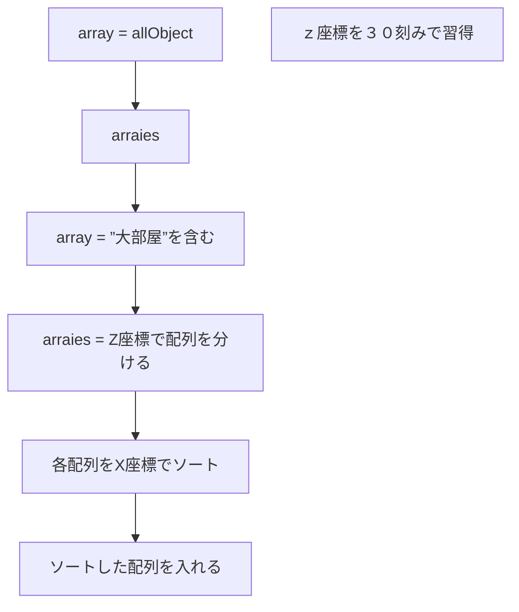

```mermaid
flowchart TB
input[array = allObject]
createarray[arraies]
search[array = ”大部屋”を含む]
sort_z[arraies = Z座標で配列を分ける]
cutobj[ｚ座標を３０刻みで習得]
sort_x[各配列をX座標でソート]

inputarray[ソートした配列を入れる]

input --> createarray
createarray --> search
search --> sort_z
sort_z --> sort_x
sort_x --> inputarray
```
