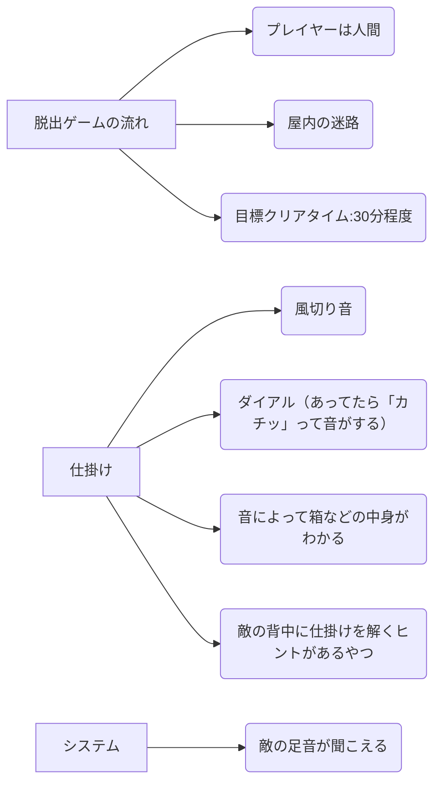
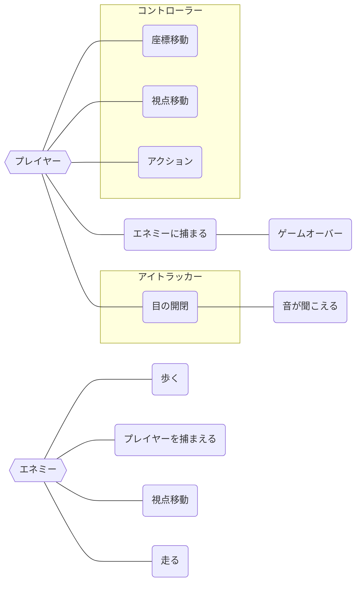

# Oz-branches の仕様書

## プレイヤー操作一覧
- ### 移動
  - キーボード：WASD
  - ゲームパッド：Lスティック
- ### ダッシュ
  - キーボード：Shiftキー
  - ゲームパッド：Rボタン
- ### 視点操作
  - キーボード：矢印キー
  - ゲームパッド：Rスティック
- ### アイテムを取る/ドアを開ける
  - キーボード：Zキー
  - ゲームパッド：Aボタン（または〇ボタン）
*** 
## オブジェクトを置換する際に必要なスクリプト達
### ドア
* door Name（変数は空欄でおｋ）
* stage Setting  
\* ドアのオブジェクトの名前を「door」+「A~Gまでの大文字アルファベット」にする必要がある  
 例）doorA

### 鍵
* key Flag（変数は空欄でおｋ）  
\*ドアに同じくオブジェクトの名前を「key」+「A~Gまでの大文字アルファベット」にする必要がある  
 例）keyA
*** 

# ユースケース図

