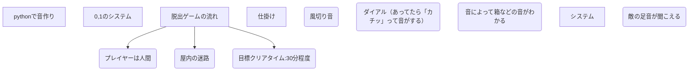

# UnityProject

```mermaid
flowchart

a[pythonで音作り]

a2[0,1のシステム]

b[脱出ゲームの流れ]

b0(プレイヤーは人間)
b1(屋内の迷路)
b2(目標クリアタイム:30分程度)

b --> b0
b --> b1
b --> b2

x[仕掛け]

x0(風切り音)
x1(ダイアル（あってたら「カチッ」って音がする）)
x2(音によって箱などの音がわかる)

s[システム]

s0(敵の足音が聞こえる)


```
