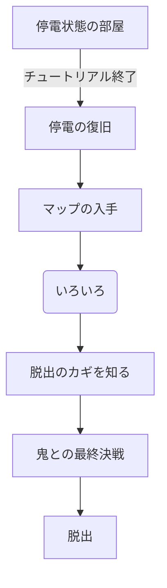

```mermaid
flowchart TB
start[停電状態の部屋]
second[停電の復旧]
map[マップの入手]
bet1(いろいろ)
key[脱出のカギを知る]
battle[鬼との最終決戦]
goal[脱出]


start -->|チュートリアル終了| second
second --> map
map --> bet1
bet1 --> key
key --> battle
battle --> goal


```
