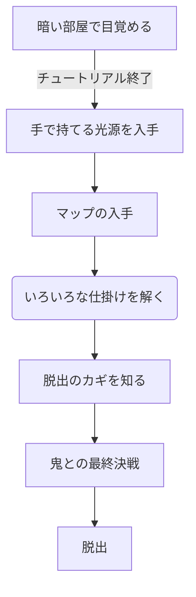

## ゲーム内容案

舞台：地下室（いくつか部屋がある）

状況：電気などの光源がない（電池式の手持ちランプ）  
　　　鬼がいる（姿は暗闇のため見えない）

クリア条件：地下室からの脱出

ステージの特徴；大部屋と通路が多い  
＞鬼に遭遇した時に見えない恐怖に追い詰められている感が欲しい  
加えて、暗闇のため小部屋だとすぐ鬼に捕まる

---

  <b>以下ゲームの大まかな流れ</b>

