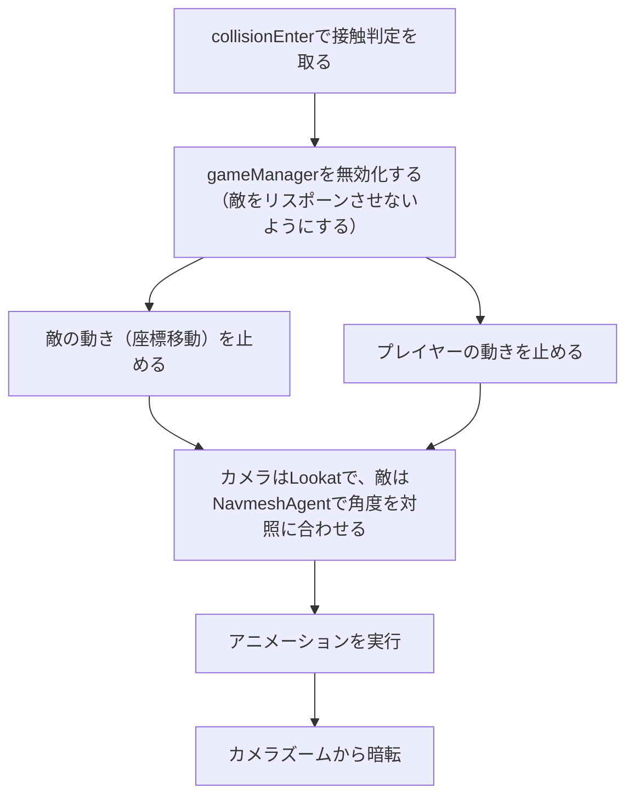

```mermaid
flowchart TB
touch[collisionEnterで接触判定を取る]
enable[gameManagerを無効化する（敵をリスポーンさせないようにする）]
stopp[プレイヤーの動きを止める]
stope[敵の動き（座標移動）を止める]
set[カメラはLookatで、敵はNavmeshAgentで角度を対照に合わせる]
anime[アニメーションを実行]
zoomout[カメラズームから暗転]

touch --> enable
enable --> stopp
enable --> stope
stope --> set
stopp --> set
set --> anime
anime --> zoomout
```