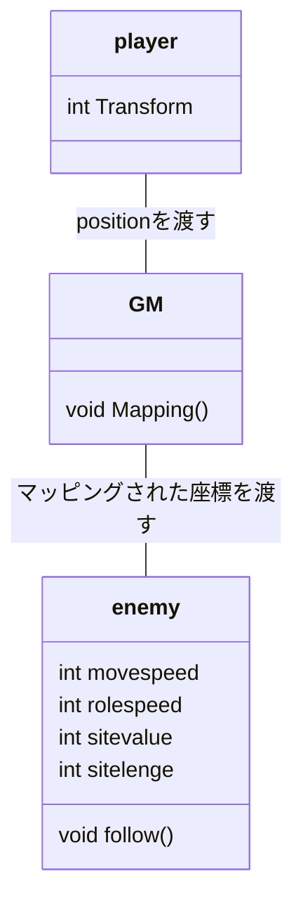

# 臨時メモ帳
ご自由にお使いください。

今のステージは後で作り直す。

```mermaid
classDiagram
class enemy
enemy : int movespeed
enemy : int rolespeed
enemy : int sitevalue
enemy : int sitelenge
enemy : void follow()

class player
player : int Transform

class GM
GM : void Mapping()

player -- GM : positionを渡す
GM -- enemy : マッピングされた座標を渡す

```
