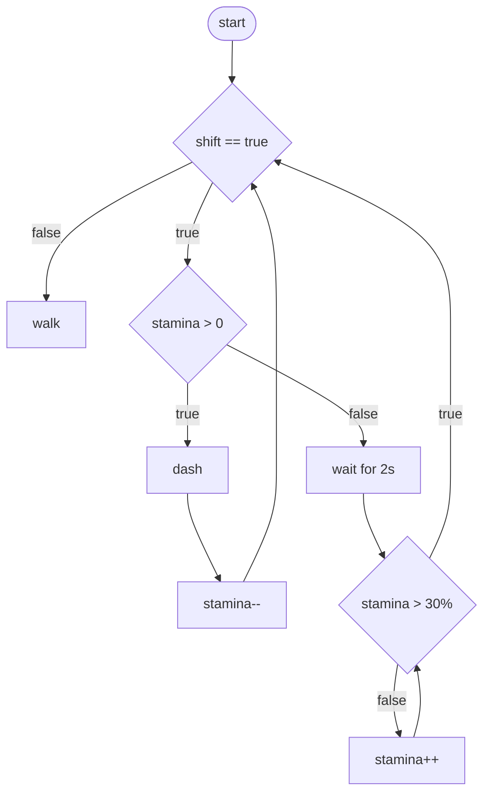

# 臨時メモ帳
コードの全体像を把握するための図を描くスペースです。
ご自由にお使いください。

## プレイヤーのダッシュの処理
ダッシュ中スタミナを消費し、スタミナが0になると、２秒後にスタミナが徐々に回復する

```mermaid
flowchart TD

_start([start])

shift{shift == true}
d[dash]
w[walk]
st1{stamina > 0}
st-[stamina--]
st0{stamina > 30%}
st+[stamina++]
wait[wait for 2s]


_start-->shift
shift--true-->st1
shift--false-->w

st1--true--> d
st1--false-->wait

d-->st-
st- --> shift

wait-->st0
st0--true-->shift
st0--false-->st+
st+-->st0
```
