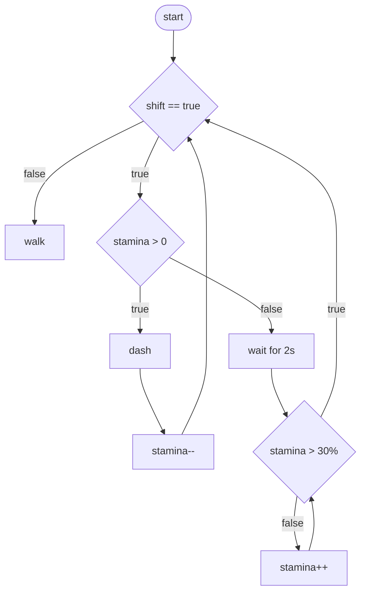
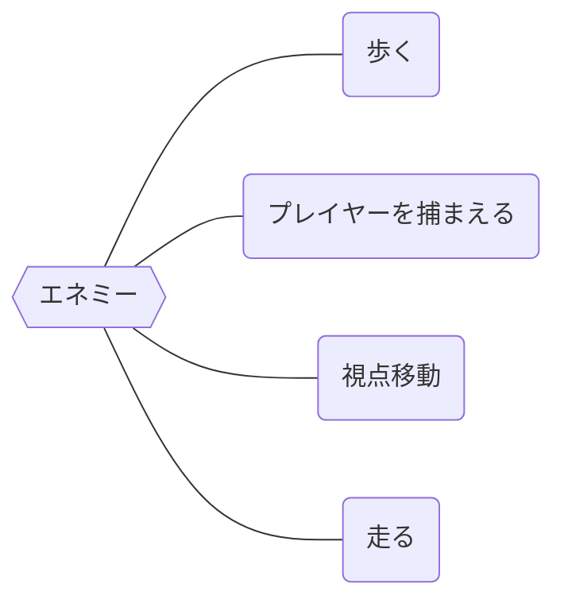
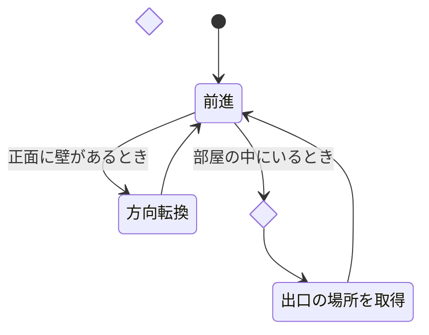

# 臨時メモ帳
コードの全体像を把握するための図を描くスペースです。
ご自由にお使いください。

## プレイヤーのダッシュの処理
ダッシュ中スタミナを消費し、スタミナが0になると、２秒後にスタミナが徐々に回復する

```mermaid
flowchart TD

_start([start])

shift{shift == true}
d[dash]
w[walk]
st1{stamina > 0}
st-[stamina--]
st0{stamina > 30%}
st+[stamina++]
wait[wait for 2s]


_start-->shift
shift--true-->st1
shift--false-->w

st1--true--> d
st1--false-->wait

d-->st-
st- --> shift

wait-->st0
st0--true-->shift
st0--false-->st+
st+-->st0
```

# 
# Enemyのアルゴリズム
案外、通常移動の設計の方がめんどくさい

マップ情報を取得する必要があるかも...
## 以下ユースケース図

```mermaid
flowchart LR
e{{エネミー}}

e0(歩く)
e1(プレイヤーを捕まえる)
e2(視点移動)
e3(走る)

e---e0
e---e1
e---e2
e---e3
```
# 通常移動、ラフ

```mermaid
stateDiagram-V2
direction TB


w : 前進
t : 方向転換
e : 出口の場所を取得
state x <<choice>>
state y <<choice>>
[*] --> w
w --> t : 正面に壁があるとき
w --> y : 部屋の中にいるとき

t --> w

y --> e
e --> w

```

